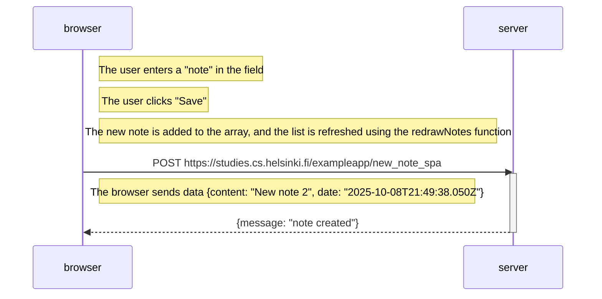

```mermaid
sequenceDiagram
    participant browser
    participant server

    Note right of browser: The user enters a "note" in the field
    
    Note right of browser: The user clicks "Save"

    Note right of browser: The new note is added to the array, and the list is refreshed using the redrawNotes function

    browser->>server: POST https://studies.cs.helsinki.fi/exampleapp/new_note_spa
    activate server
    Note right of browser: The browser sends data {content: "New note 2", date: "2025-10-08T21:49:38.050Z"}
    server-->>browser: {message: "note created"}
    deactivate server
```